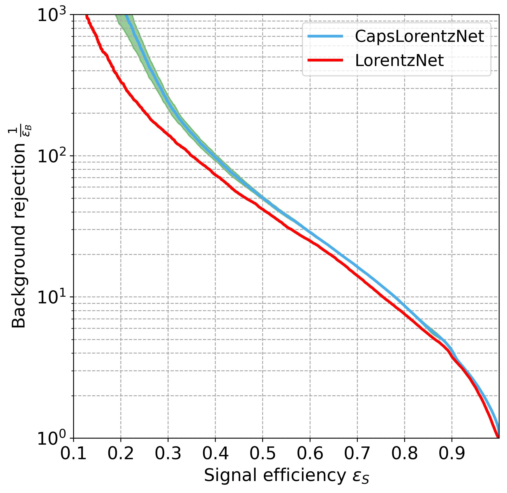

# CapsLorentzNet: Integrating Physics Inspired Features with Graph Convolution


<b>Rameswar Sahu</b>


**Abstract:** With the advent of advanced machine learning techniques, boosted object tagging has witnessed significant progress. In this article, we take this field further by introducing novel architectural modifications compatible with a wide array of Graph Neural Network (GNN) architectures. Our approach advocates for integrating capsule layers, replacing the conventional decoding blocks in standard GNNs. These capsules are a group of neurons with vector activations. The orientation of these vectors represents important properties of the objects under study, with their magnitude characterizing whether the object under study belongs to the class represented by the capsule. Moreover, capsule networks incorporate a regularization by reconstruction mechanism, facilitating the seamless integration of expert-designed high-level features into the analysis. We have studied the usefulness of our architecture with the LorentzNet architecture for quark-gluon tagging. Here, we have replaced the decoding block of LorentzNet with a capsulated decoding block and have called the resulting architecture CapsLorentzNet. Our new architecture can enhance the performance of LorentzNet by 20 \% for the quark-gluon tagging task.


## Table of Contents
<details>
<summary>Click to expand</summary>

- [Requirements](#requirements)
- [Quark-gluon Tagging](#quark-gluon-tagging)
  - [Data](#data-1)
  - [Training](#training-1)
  - [Evaluation](#evaluation-1)
  - [Pre-trained Model](#pre-trained-model-1)
- [ROC Curves](#roc-curves)
- [Citation](#citation)

</details>

## Requirements
- `Python>=3.7`, `PyTorch>=1.9`, and `CUDA toolkit>=10.2`.
- Use the following command to install required packages.
    - ```pip install -r requirements.txt```
- We use 4 GPUs for training and evaluation. However, it is acceptable to use fewer or more GPUs to train or test the model, simply changing the arg `--nproc_per_node=4` to the number of GPUs available.


## Quark-gluon Tagging


### Data

Download the dataset from https://doi.org/10.5281/zenodo.10829856. Make a directory inside the `./data` folder and save the data. The arg `--datadir /path/to/data/` can be assigned to specify the data path.


### Training
Parallelly training the CapsLorentzNet on 4 GPUs:

```sh
torchrun --nproc_per_node=4 main.py --exp_name=try1 --datadir='./data/try1' \
         --logdir='./logs/' --batch_size=32 --epochs=35  --seed=99

```
One can assign `--exp_name` to identity different runs. 
Model with the best validation accuracy will be saved in log directory as `best-val-model.pt`.

### Evaluation
Given a specific `--exp_name`, use `--test_mode` to evalute the best model on the test dataset. 
```sh
torchrun --nproc_per_node=4 main.py --exp_name=try1 --datadir='./data/try1' --logdir='./logs/' \
         --batch_size=32 --epochs=35  --seed=99 --test_mode
```

### Pre-trained Model
Pre-trained model are offered in [`./logs/pretrained/`]. There are six models for six random initialization of seeds.

## ROC Curves

<figure>
<p align="center"></p>
<figcaption align = "center"> <b>(left)</b>:  ROC curves of the LorentzNet (red) and CapsLorentzNet(blue) Classifiers. </figcaption>
</figure>


## Citation
If you find this work helpful, please cite our paper:


Also cite the original LorentzNet Paper:

```
@article{gong2022efficient,
  author={Gong, Shiqi and Meng, Qi and Zhang, Jue and Qu, Huilin and Li, Congqiao and Qian, Sitian and Du, Weitao and Ma, Zhi-Ming and Liu, Tie-Yan},
  title={An efficient Lorentz equivariant graph neural network for jet tagging},
  journal={Journal of High Energy Physics},
  year={2022},
  month={Jul},
  day={05},
  volume={2022},
  number={7},
  pages={30},
  issn={1029-8479},
  doi={10.1007/JHEP07(2022)030},
  url={https://doi.org/10.1007/JHEP07(2022)030}
}
```
